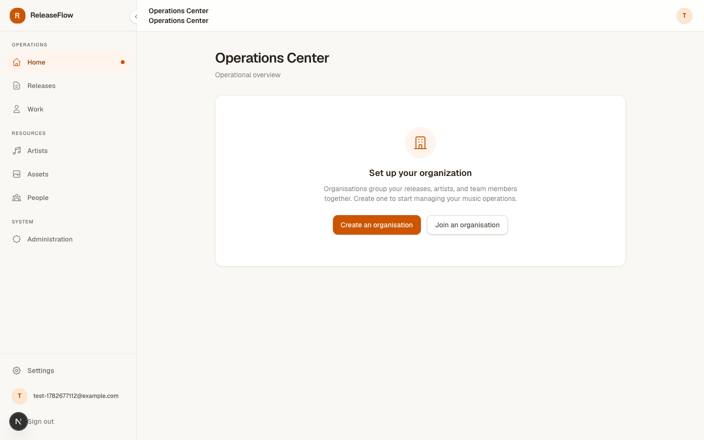
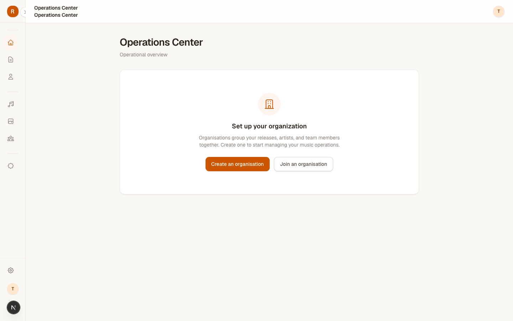
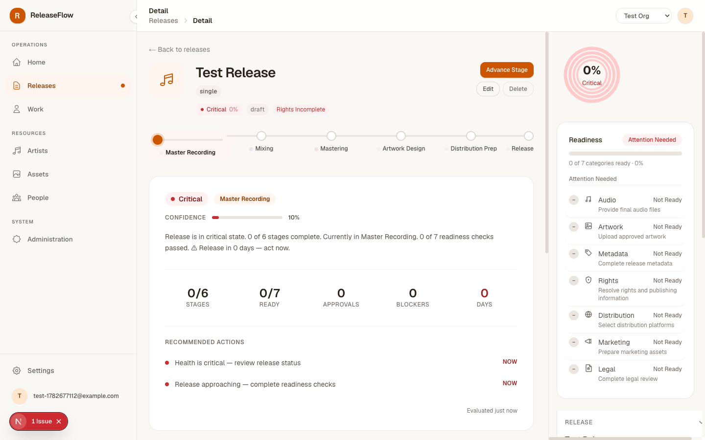
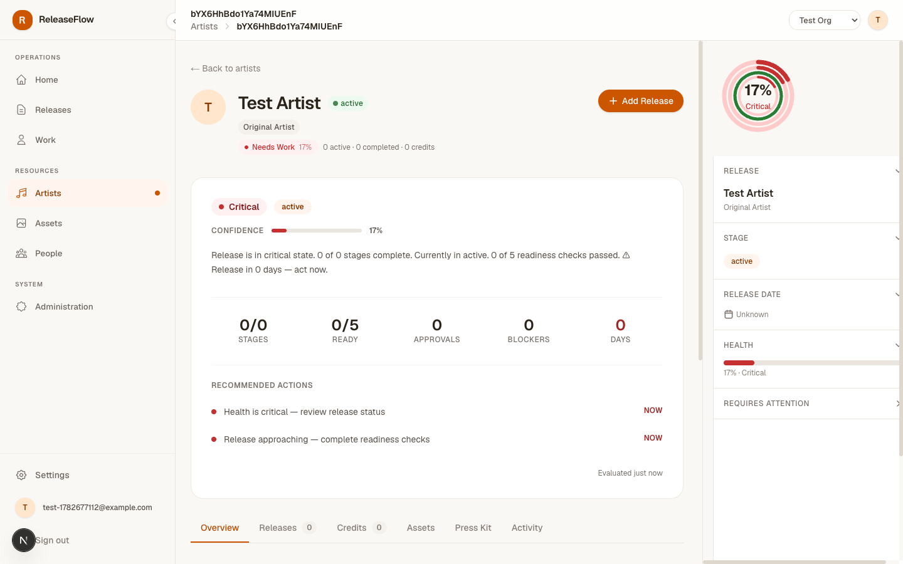
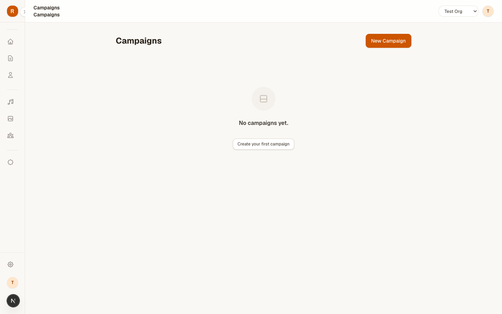

# PX-304.2 — Before / After

## Operations Center

### Before

*Competing H1 in content, heavy borders, cramped footer, dense alert padding.*

### After

**Hierarchy:** Topbar owns the H1; content starts with date + summary.  
**Spacing:** Section breathing room increased to 56px (`mb-14`).  
**Typography:** Subtitle spacing increased 4px; metadata recedes.  
**Surface:** Org Pulse border removed; footer divider removed; alert borders softened to 70%.

---

## Sidebar

### Before (Expanded)

### After (Expanded)

**Polish:** Active indicator enlarged to `h-2 w-2`; nav spacing increased to `space-y-1`; brand gap tightened to `gap-2.5`; footer rule lightened to `border-surface-200/60`.

### Before (Collapsed)

### After (Collapsed)

**No behavioural change.** Collapse width, transition, and localStorage preference remain identical.

---

## Release Workspace

### After

**Hierarchy:** Release title is no longer an H1; topbar displays it.  
**Surface:** Decorative ring removed from hero icon; card border softened.  
**Typography:** All content headings are now `<h2>` or `
`, preventing hierarchy competition.

---

## Artist Workspace

### After

**Hierarchy:** Artist name moved from H1 to `
`; topbar owns the screen title.  
**Surface:** Release card border reduced opacity; shadow token corrected to `shadow-raised`.  
**Composition:** Profile header spacing unchanged but now sits below a single, authoritative H1.

---

## Empty State

### After

**Whitespace:** `py-20` gives the void presence.  
**Typography:** Title scaled to `text-base`; description widened to `max-w-sm` with `leading-6`.  
**CTA:** Elevated with `mt-8` so the action feels like an invitation, not an afterthought.

---

## Hero (Operational Summary)

### Before
*Visible within the PX-304.1 Operations Center screenshot.*

### After
*Visible within the PX-304.2 Operations Center screenshot.*

**Dominance:** Padding increased to `p-8`; confidence bar thickened to `h-1.5`; metric rows separated by `gap-3` and `pt-8` dividers; timestamp pushed to `mt-6` and receded to `text-text-400`.
